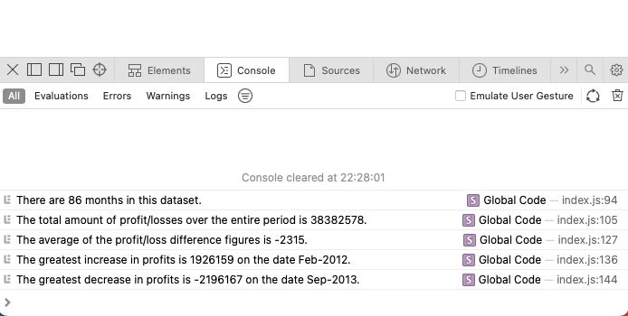

# console_finances

## Description
Using JavaScript I have processed an array of data.

I have found the following:

- The total number of months included in the dataset.
- The net total amount of Profit/Losses over the entire period.
- The average of the **changes** in Profit/Losses over the entire period.
- The greatest increase in profits (date and amount) over the entire period.
- The greatest decrease in losses (date and amount) over the entire period.

## Installation
The collected data can be accessed [here](https://lolanewell.github.io/console_finances), then inspecting the webpage and going to the console.

## Usage
This is how it looks in the console:

## Credit
N/A

## License
N/A